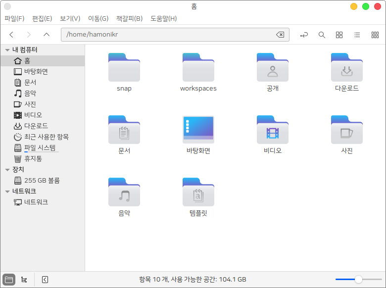
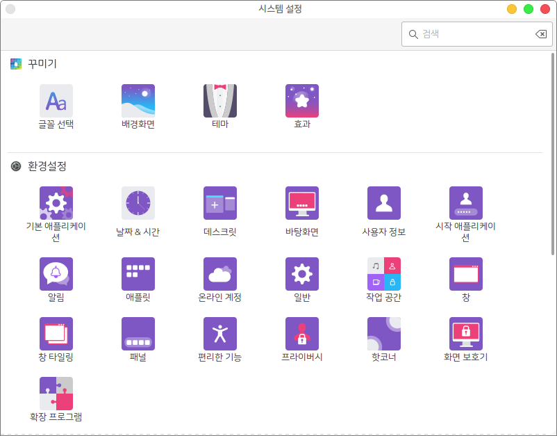

## hamonikr-icons

하모니카OS 에서 사용되는 아이콘 테마 입니다.

This project is HamoniKR Desktop Icons.

* 지원 환경 : Ubuntu (>=20.04) , HamoniKR (>=5.0)





## Install

먼저, 하모니카 APT 저장소가 없는 경우에는, 아래와 같이 저장소를 추가해 주세요.
If you do not have a HamoniKR APT settings, please install it first by following the instructions below.

```
wget -qO- https://repo.hamonikr.org/hamonikr-app.apt | sudo -E bash -

   또는

curl -sL https://repo.hamonikr.org/hamonikr-app.apt | sudo -E bash -
```

아이콘 테마 설치하기
Install Icons

```
sudo apt install hamonikr-icons
```

## License

 * GPL-3 : [LICENSE File](./LICENSE)

## Issue or Suggestion

[이슈 페이지](https://github.com/hamonikr/hamonikr5.0-hamonikr-icons/issues) 또는 [하모니카 커뮤니티](https://hamonikr.org)에서 공유해주세요.
